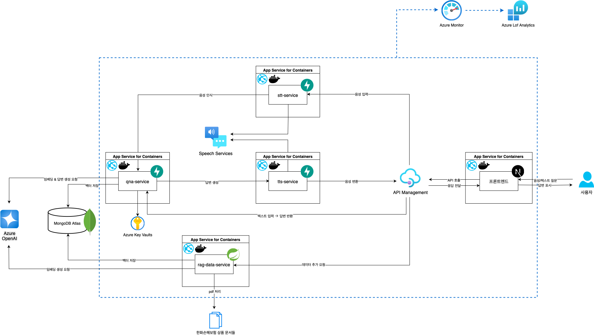
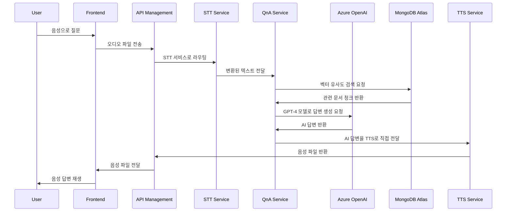
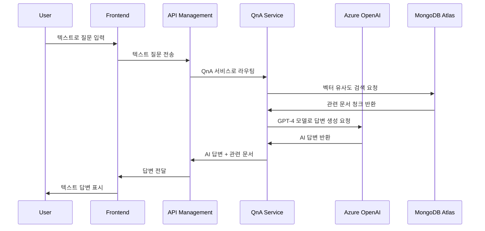
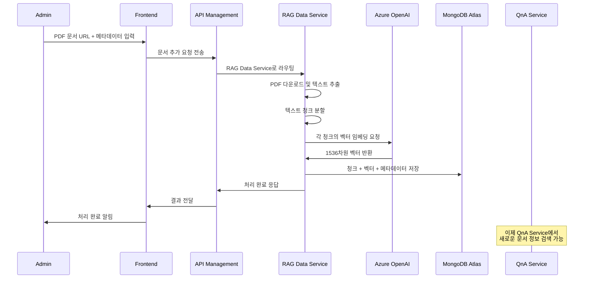

# 🏢 KT AICC 기반 RAG 상담 지원 서비스

> **KT의 AICC(AI Contact Center)를 본떠 만든 RAG(Retrieval-Augmented Generation) 기반 AI 상담 지원 서비스로, 사용자의 자연어 입력을 벡터화하여 사전 임베딩된 답변들과 비교하고, 가장 유사한 답변을 자동으로 추천하는 시스템**

## 📋 시스템 개요

본 시스템은 **KT의 AICC(AI Contact Center)를 본떠 만든 RAG(Retrieval-Augmented Generation) 기반 AI 상담 지원 서비스**입니다. 사용자의 질문(텍스트/음성)을 받아 관련 정보를 검색하고, AI가 생성한 답변을 음성으로 제공하여 고객 상담 경험을 향상시킵니다. 

**한화손해보험**을 고객사로 가정하여 구현한 사례로, 보험 상품 관련 상담을 지원하는 시스템입니다.

### 🌟 핵심 특징
- **🤖 RAG 기반 답변 생성**: 벡터 검색을 통한 정확한 보험 정보 제공
- **🎤 음성 상담 지원**: STT(음성→텍스트) + TTS(텍스트→음성) 통합
- **📚 동적 데이터 관리**: 실시간 보험 상품 정보 업데이트
- **🌐 웹 기반 인터페이스**: 직관적인 사용자 경험
- **⚡ 마이크로서비스 아키텍처**: 확장 가능하고 유지보수 용이한 구조

## 🏗️ 시스템 아키텍처



## 🚀 구성 서비스

### 1. **QnA Service** - 핵심 RAG 엔진
- **Repository**: [project03_model](https://github.com/hadonas/project03_model)
- **목적**: 사용자 질문에 대한 AI 답변 생성 및 관련 문서 검색
- **기술**: FastAPI, Azure OpenAI, MongoDB Atlas, LangChain

### 2. **RAG Data Service** - 데이터 관리
- **Repository**: [rag-data-service](https://github.com/younyoungieo/rag-data-service)
- **목적**: PDF 문서를 처리하여 RAG 시스템을 위한 벡터 데이터베이스 구축
- **기술**: Spring Boot 3.5.4, Java 21, MongoDB, Azure OpenAI
- **배포**: Azure App Service for Containers

### 3. **Frontend** - 사용자 인터페이스
- **Repository**: [kt_project_frontend](https://github.com/hadonas/kt_project_frontend)
- **목적**: 웹 기반 상담 인터페이스
- **기술**: React, TypeScript, 모던 UI/UX

### 4. **TTS Service** - 음성 합성
- **Repository**: [tts-service](https://github.com/changhyeongHa/tts-service)
- **목적**: AI 답변을 자연스러운 음성으로 변환
- **기술**: FastAPI, Azure Neural Voice, 다국어 지원
- **배포**: Azure App Service for Containers

### 5. **STT Service** - 음성 인식
- **Repository**: [stt-service](https://github.com/changhyeongHa/stt-service)
- **목적**: 사용자 음성 질문을 텍스트로 변환
- **기술**: FastAPI, Azure Cognitive Services, 다국어 지원
- **배포**: Azure App Service for Containers


## 🛠️ 기술 스택

| 구분 | 기술 | 용도 |
|------|------|------|
| **API Gateway** | Azure API Management | API 라우팅, 인증, 모니터링 |
| **Backend Framework** | FastAPI, Spring Boot | 마이크로서비스 API 서버 |
| **AI/ML** | Azure OpenAI (GPT-4, text-embedding-ada-002) | 자연어 처리, 답변 생성, 벡터 임베딩 |
| **Vector Database** | MongoDB Atlas | 벡터 검색 및 문서 저장 |
| **Speech Services** | Azure Cognitive Services | STT/TTS 처리 |
| **Frontend** | Next.js (React + TypeScript) | 풀스택 웹 프레임워크 및 사용자 인터페이스 |
| **Container** | Docker | 서비스 컨테이너화 |
| **Language** | Python 3.11+, Java 21 | 백엔드 서비스 |
| **Runtime** | Uvicorn, JVM | ASGI 웹 서버, Java 런타임 |
| **Monitoring** | Azure Monitor, Log Analytics | 중앙 집중식 모니터링 및 로그 분석 |

## 🗄️ 데이터베이스 스키마

📊 **데이터 구조**

MongoDB는 두 개의 컬렉션으로 구성되어 있습니다. 자세한 스키마 정보는 [MongoDB 스키마 문서](./mongodb_schema.md)를 참조하세요:

📋 **products 컬렉션 (상품 정보)**

| 필드명 | 설명 | 예시 |
|--------|------|------|
| _id | 고유 식별자 | ObjectId |
| product_group | 상품군 | "자동차보험-개인용" |
| product_name | 상품명 | "한화다이렉트자동차보험" |
| sale_period | 판매기간 | "2025.08.16~현재" |

📄 **documents 컬렉션 (문서 청크)**

| 필드명 | 설명 | 예시 |
|--------|------|------|
| _id | 고유 식별자 | ObjectId |
| content | 텍스트 청크 내용 | "이 약관은 보험소비자의 권익보호..." |
| embedding | 벡터 임베딩 | [0.123, -0.456, ...] |
| source | PDF 파일명 | "한화다이렉트자동차보험_2025.08.16~현재_약관.pdf" |
| page_number | 페이지 번호 | 1, 2, 3... |
| chunk_index | 페이지 내 청크 순서 | 0, 1, 2... |
| chunk_length | 청크 길이 (문자 수) | 331, 581, 706... |
| product_id | 상품 참조 ID | ObjectId("products 컬렉션 참조") |
| type | 문서타입 | "상품요약", "약관", "사업방법" |
| download_link | 원본 문서 링크 | "https://www.hwgeneralins.com/..." |
| created_at | 생성 시간 | ISODate("2025-01-XX") |


### 📋 API 계약 명세 요약

각 서비스의 주요 API 엔드포인트와 간단한 설명입니다. **상세한 API 계약 명세는 [api-contracts.md](./api-contracts.md)를 참조하세요.**

#### 🧠 QnA Service
- **GET /**: 서비스 상태 확인
- **GET /health**: 상세 헬스체크
- **POST /qna**: 질문-답변 처리 (RAG 기반 AI 답변 생성)

#### 📚 RAG Data Service
- **POST /api/v1/documents**: PDF 문서 업로드 및 벡터 처리
- **GET /api/v1/health**: 서비스 상태 확인
- **GET /actuator/health**: Spring Boot Actuator 헬스체크

#### 🎤 TTS Service
- **GET /, GET /health**: 서비스 상태 확인
- **POST /tts/convert**: 텍스트를 WAV 파일로 변환
- **POST /tts/convert-json**: JSON 응답 형태
- **POST /tts/convert-rag-response**: RAG 응답을 Multipart 형태로 변환
- **POST /tts/convert-rag-response-file**: RAG 응답을 WAV 파일로 직접 다운로드

#### 🎧 STT Service
- **POST /stt/convert**: 음성을 텍스트로 변환 (메인 엔드포인트)
- **GET /health**: 서비스 상태 확인
- **GET /docs, GET /redoc**: API 문서 (Swagger UI, ReDoc)


```

## 📡 API 통합 예시

### 🔄 전체 상담 플로우

#### 1. 음성 상담 플로우


#### 2. 텍스트 상담 플로우


#### 3. 문서 추가 워크플로우


### 📝 API 호출 예시

#### 1. 음성 상담 처리
```bash
# 1. STT: 음성을 텍스트로 변환
curl -X POST "https://your-stt-service.azurewebsites.net/stt/convert" \
  -F "audio_file=@question.wav" \
  -F "locale=ko-KR"

# 2. QnA: AI 답변 생성
curl -X POST "https://your-qna-service.azurewebsites.net/qna" \
  -H "Content-Type: application/json" \
  -d '{"input_message": "자동차보험료 계산 방법 알려줘"}'

# 3. TTS: 답변을 음성으로 변환
curl -X POST "https://your-tts-service.azurewebsites.net/tts/convert" \
  -H "Content-Type: application/json" \
  -d '{"text": "자동차보험료는 다음과 같이 계산됩니다..."}'

# 4. TTS: RAG 응답을 직접 음성으로 변환
curl -X POST "https://your-tts-service.azurewebsites.net/tts/convert-rag-response-file" \
  -H "Content-Type: application/json" \
  -d '{
    "success": true,
    "messages": [
      {"HumanMessage": "자동차보험료 계산 방법 알려줘"},
      {"AIMessage": "자동차보험료는 다음과 같이 계산됩니다..."}
    ],
    "citations": [
      {"title": "보험료계산서.pdf", "page": 15}
    ]
  }' \
  --output rag_answer.wav
```

#### 2. 텍스트 상담 처리
```bash
# QnA: 텍스트 질문에 대한 AI 답변 생성
curl -X POST "https://your-qna-service.azurewebsites.net/qna" \
  -H "Content-Type: application/json" \
  -d '{"input_message": "수렵보험의 보장 범위는 어떻게 되나요?"}'
```

#### 3. 새로운 보험 상품 문서 추가
```bash
# RAG Data Service: PDF 문서 업로드 및 벡터 처리
curl -X POST "https://your-rag-data-service.azurewebsites.net/api/v1/documents" \
  -H "Content-Type: application/json" \
  -d '{
    "link": "https://www.hwgeneralins.com/upload/hmpag_upload/product/hunt(2506)_03.pdf",
    "product_group": "일반보험-종합",
    "product_name": "수렵보험",
    "sale_period": "2025.06.30~현재",
    "document_type": "약관"
  }'
```

## 🚀 설치 및 실행

### 사전 요구사항
- Azure 구독 (OpenAI, Speech Services)
- MongoDB Atlas 계정

### 1. 저장소 클론
```bash
# 메인 시스템 저장소
git clone https://github.com/your-org/kt_aicc_hub.git
cd kt_aicc_hub

# 각 서비스 저장소
git clone https://github.com/changhyeongHa/project03_model.git qna-service
git clone https://github.com/younyoungieo/rag-data-service.git rag-data-service
git clone https://github.com/hadonas/kt_project_frontend.git frontend
git clone https://github.com/changhyeongHa/tts-service.git tts-service
git clone https://github.com/changhyeongHa/stt-service.git stt-service
```

### 2. 환경 변수 설정
각 서비스의 환경 변수는 Azure App Service 설정에서 구성됩니다.

**필수 환경 변수:**
- `AZURE_OPENAI_API_KEY`: Azure OpenAI API 키
- `AZURE_OPENAI_ENDPOINT`: Azure OpenAI 엔드포인트
- `AZURE_OPENAI_DEPLOYMENT_NAME`: Azure OpenAI 배포명 (예: text-embedding-ada-002)
- `AZURE_OPENAI_API_VERSION`: Azure OpenAI API 버전 (예: 2023-05-15)
- `AZURE_SPEECH_KEY`: Azure Speech Service API 키
- `AZURE_SPEECH_REGION`: Azure Speech Service 지역
- `MONGODB_URI`: MongoDB Atlas 연결 문자열
- `MONGODB_DB`: MongoDB 데이터베이스명 (예: insurance)

## 📊 시스템 모니터링

### 헬스체크
```bash
# 각 서비스 상태 확인
curl https://your-qna-service.azurewebsites.net/health      # QnA Service
curl https://your-rag-data-service.azurewebsites.net/health # RAG Data Service
curl https://your-stt-service.azurewebsites.net/health     # STT Service
curl https://your-tts-service.azurewebsites.net/health     # TTS Service
```

## 📚 추가 문서

각 서비스의 상세한 사용법과 API 명세는 다음 문서를 참조하세요:

- **QnA Service**: [project03_model](https://github.com/hadonas/project03_model)
- **RAG Data Service**: [rag-data-service](https://github.com/younyoungieo/rag-data-service)
- **Frontend**: [kt_project_frontend](https://github.com/hadonas/kt_project_frontend)
- **TTS Service**: [tts-service](https://github.com/changhyeongHa/tts-service)
- **STT Service**: [stt-service](https://github.com/changhyeongHa/stt-service)

