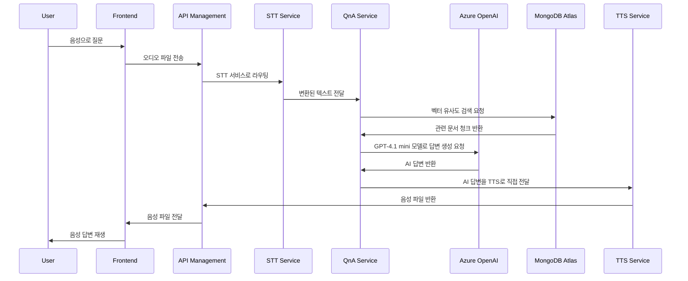
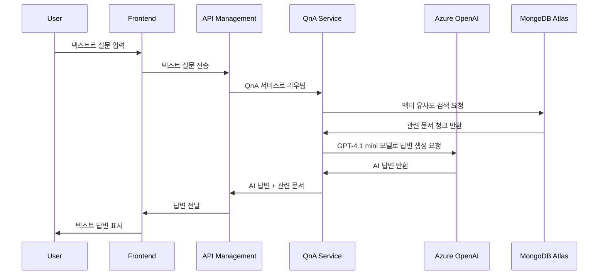
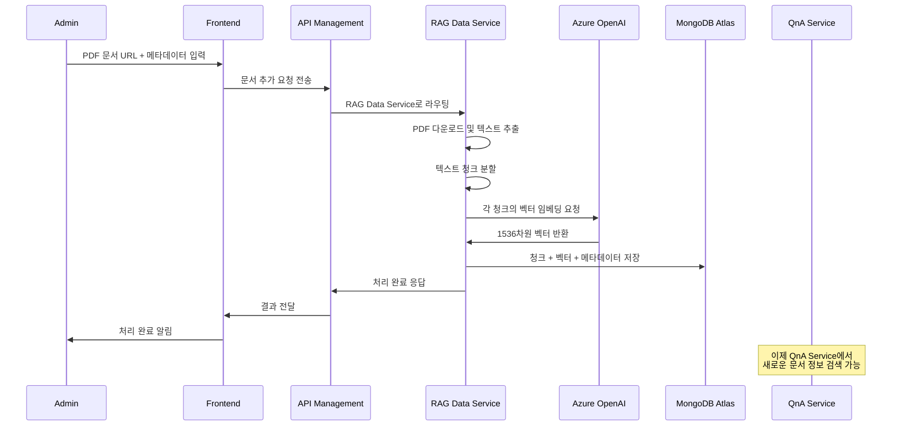
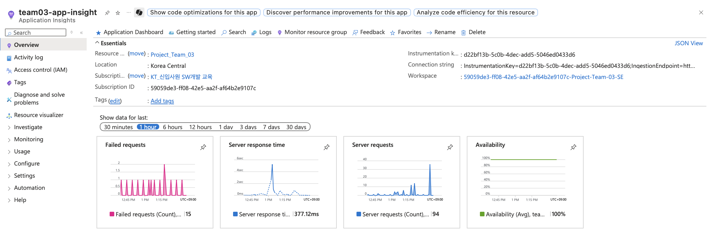

# 🏢 KT AICC 기반 RAG 상담 지원 서비스

> **KT의 AICC(AI Contact Center)를 본떠 만든 RAG(Retrieval-Augmented Generation) 기반 AI 상담 지원 서비스로, 사용자의 자연어 입력을 벡터화하여 사전 임베딩된 답변들과 비교하고, 가장 유사한 답변을 자동으로 추천하는 시스템**

## 📋 시스템 개요

본 시스템은 **KT의 AICC(AI Contact Center)를 본떠 만든 RAG(Retrieval-Augmented Generation) 기반 AI 상담 지원 서비스**입니다. 사용자의 질문(텍스트/음성)을 받아 관련 정보를 검색하고, AI가 생성한 답변을 음성으로 제공하여 고객 상담 경험을 향상시킵니다. 

**한화손해보험**을 고객사로 가정하여 구현한 사례로, 보험 상품 관련 상담을 지원하는 시스템입니다.

## 📑 목차

### 🎯 발표 순서
- [📋 시스템 개요](#-시스템-개요) - 인트로(서비스 소개)
- [📡 API 통합 예시](#-api-통합-예시) - 시퀀스 다이어그램 (하이브리드 검색 엔진 & 문서 추가 워크플로우)
- [🏗️ 시스템 아키텍처](#️-시스템-아키텍처) - 아키텍처 다이어그램 (Azure 활용 강조)
- [📊 시스템 모니터링 및 장애 대응](#-시스템-모니터링-및-장애-대응) - Application Insights 모니터링 지표

### 📚 상세 정보
- [🚀 구성 서비스](#-구성-서비스)
- [🛠️ 기술 스택](#️-기술-스택)
- [🗄️ 데이터베이스 스키마](#️-데이터베이스-스키마)
- [📋 API 계약 명세 요약](#-api-계약-명세-요약)
- [🚀 설치 및 실행](#-설치-및-실행)
- [📋 ADR (Architecture Decision Records)](#-adr-architecture-decision-records)
- [🏗️ MSA 아키텍처 보드](#️-msa-아키텍처-보드)

### 📚 관련 문서

- **[🏗️ 시스템 아키텍처](./system_architecture.png)** - 전체 시스템 구조도
- **[🗄️ MongoDB 스키마](./mongodb_schema.md)** - 데이터베이스 구조
- **[📋 API 계약 명세](./api-contracts.md)** - 상세한 API 스펙
- **[📋 ADR 문서](./adr/)** - 아키텍처 결정 기록
- **[🏗️ MSA 아키텍처 보드](./msa_board.md)** - 마이크로서비스 아키텍처와 확장 계획


### 🌟 핵심 특징
- **🤖 RAG 기반 답변 생성**: 벡터 검색을 통한 정확한 보험 정보 제공으로 신뢰성 높은 답변 생성
- **🔍 하이브리드 검색 엔진**: 키워드 검색과 벡터 검색을 가중치를 적용해 결합한 혁신적인 검색 방식으로 검색 정확도 극대화
- **🎤 음성 상담 지원**: STT(음성→텍스트) + TTS(텍스트→음성) 통합으로 접근성 향상 및 상담 효율성 증대
- **📚 동적 데이터 관리**: PDF 업로드 시 실시간 모델 반영으로 최신 보험 상품 정보 즉시 활용 가능
- **🔌 RESTful API 기반**: 표준화된 API로 다양한 클라이언트와의 쉬운 통합
- **⚡ 마이크로서비스 아키텍처**: 독립적인 서비스 배포와 확장으로 높은 가용성과 유지보수성 확보
- **🔗 원본 문서 다운로드**: citations 배열의 download_link 필드를 통해 AI 답변의 근거가 된 원본 문서 직접 다운로드 지원
- **🚀 자동화된 배포**: QnA Service의 GitHub Actions 기반 CI/CD 파이프라인으로 코드 변경 시 자동 테스트, 빌드, 배포

## 📡 API 통합 예시

### 🔄 전체 상담 플로우

#### 1. 음성 상담 플로우


#### 2. 텍스트 상담 플로우


#### 3. 문서 추가 워크플로우


### 📝 API 호출 예시

#### 1. 음성 상담 처리
```bash
# 1. STT: 음성을 텍스트로 변환
curl -X POST "https://your-stt-service.azurewebsites.net/stt/convert" \
  -F "audio_file=@question.wav" \
  -F "locale=ko-KR"

# 2. QnA: AI 답변 생성
curl -X POST "https://your-qna-service.azurewebsites.net/qna" \
  -H "Content-Type: application/json" \
  -d '{"input_message": "자동차보험료 계산 방법 알려줘"}'

# 3. TTS: 답변을 음성으로 변환
curl -X POST "https://your-tts-service.azurewebsites.net/tts/convert" \
  -H "Content-Type: application/json" \
  -d '{"text": "자동차보험료는 다음과 같이 계산됩니다..."}'

# 4. TTS: RAG 응답을 직접 음성으로 변환
curl -X POST "https://your-tts-service.azurewebsites.net/tts/convert-rag-response-file" \
  -H "Content-Type: application/json" \
  -d '{
    "success": true,
    "messages": [
      {"HumanMessage": "자동차보험료 계산 방법 알려줘"},
      {"AIMessage": "자동차보험료는 다음과 같이 계산됩니다..."}
    ],
    "citations": [
      {
        "title": "보험료계산서.pdf", 
        "page": 15,
        "download_link": "https://www.hwgeneralins.com/upload/hmpag_upload/product/movable(2501)_..."
      }
    ]
  }' \
  --output rag_answer.wav
```

#### 2. 텍스트 상담 처리
```bash
# QnA: 텍스트 질문에 대한 AI 답변 생성
curl -X POST "https://your-qna-service.azurewebsites.net/qna" \
  -H "Content-Type: application/json" \
  -d '{"input_message": "수렵보험의 보장 범위는 어떻게 되나요?"}'
```

#### 3. 새로운 보험 상품 문서 추가
```bash
# RAG Data Service: PDF 문서 업로드 및 벡터 처리
curl -X POST "https://your-rag-data-service.azurewebsites.net/api/v1/documents" \
  -H "Content-Type: application/json" \
  -d '{
    "link": "https://www.hwgeneralins.com/upload/hmpag_upload/product/hunt(2506)_03.pdf",
    "product_group": "일반보험-종합",
    "product_name": "수렵보험",
    "sale_period": "2025.06.30~현재",
    "document_type": "약관"
  }'
```

## 🏗️ 시스템 아키텍처


## 🚀 구성 서비스

### 1. **QnA Service** - 핵심 RAG 엔진
- **Repository**: [project03_model](https://github.com/hadonas/project03_model)
- **목적**: 사용자 질문에 대한 AI 답변 생성 및 관련 문서 검색
- **기술**: FastAPI, Azure OpenAI, MongoDB Atlas, LangChain
- **🔍 검색 방식**: 키워드 검색과 벡터 검색을 가중치를 적용해 결합한 하이브리드 검색으로 검색 정확도 극대화
- **CI/CD**: GitHub Actions 기반 자동 테스트, 빌드, 배포

### 2. **RAG Data Service** - 데이터 관리
- **Repository**: [rag-data-service](https://github.com/younyoungieo/rag-data-service)
- **목적**: PDF 문서를 처리하여 RAG 시스템을 위한 벡터 데이터베이스 구축
- **기술**: Spring Boot 3.5.4, Java 21, MongoDB, Azure OpenAI
- **배포**: Azure App Service for Containers

### 3. **Frontend** - 사용자 인터페이스
- **Repository**: [kt_project_frontend](https://github.com/hadonas/kt_project_frontend)
- **목적**: 웹 기반 상담 인터페이스
- **기술**: React, TypeScript, 모던 UI/UX

### 4. **TTS Service** - 음성 합성
- **Repository**: [tts-service](https://github.com/changhyeongHa/tts-service)
- **목적**: AI 답변을 자연스러운 음성으로 변환
- **기술**: FastAPI, Azure Neural Voice, 다국어 지원
- **배포**: Azure App Service for Containers

### 5. **STT Service** - 음성 인식
- **Repository**: [stt-service](https://github.com/changhyeongHa/stt-service)
- **목적**: 사용자 음성 질문을 텍스트로 변환
- **기술**: FastAPI, Azure Cognitive Services, 다국어 지원
- **배포**: Azure App Service for Containers


## 🛠️ 기술 스택

| 구분 | 기술 | 용도 |
|------|------|------|
| **API Gateway** | Azure API Management | API 라우팅, 인증, 모니터링 |
| **Backend Framework** | FastAPI, Spring Boot | 마이크로서비스 API 서버 |
| **AI/ML** | Azure OpenAI (GPT-4.1 mini, text-embedding-ada-002) | 자연어 처리, 답변 생성, 벡터 임베딩 |
| **Vector Database** | MongoDB Atlas | 벡터 검색 및 문서 저장 |
| **Speech Services** | Azure Cognitive Services | STT/TTS 처리 |
| **Frontend** | Next.js (React + TypeScript) | 풀스택 웹 프레임워크 및 사용자 인터페이스 |
| **Container** | Docker | 서비스 컨테이너화 |
| **Language** | Python 3.11+, Java 21 | 백엔드 서비스 |
| **Runtime** | Uvicorn, JVM | ASGI 웹 서버, Java 런타임 |
| **Security** | Azure Key Vault | 민감한 정보(API 키, 비밀번호) 보안 관리 |
| **Monitoring** | Azure Monitor, Log Analytics | 중앙 집중식 모니터링 및 로그 분석 |

## 🗄️ 데이터베이스 스키마

📊 **데이터 구조**

MongoDB는 두 개의 컬렉션으로 구성되어 있습니다.

> **📖 상세 스키마 정보**
> 
> 자세한 스키마 정보는 **[MongoDB 스키마 문서](./mongodb_schema.md)**를 참조하세요.

📋 **products 컬렉션 (상품 정보)**

| 필드명 | 설명 | 예시 |
|--------|------|------|
| _id | 고유 식별자 | ObjectId |
| product_group | 상품군 | "자동차보험-개인용" |
| product_name | 상품명 | "한화다이렉트자동차보험" |
| sale_period | 판매기간 | "2025.08.16~현재" |

📄 **documents 컬렉션 (문서 청크)**

| 필드명 | 설명 | 예시 |
|--------|------|------|
| _id | 고유 식별자 | ObjectId |
| content | 텍스트 청크 내용 | "이 약관은 보험소비자의 권익보호..." |
| embedding | 벡터 임베딩 | [0.123, -0.456, ...] |
| source | PDF 파일명 | "한화다이렉트자동차보험_2025.08.16~현재_약관.pdf" |
| page_number | 페이지 번호 | 1, 2, 3... |
| chunk_index | 페이지 내 청크 순서 | 0, 1, 2... |
| chunk_length | 청크 길이 (문자 수) | 331, 581, 706... |
| product_id | 상품 참조 ID | ObjectId("products 컬렉션 참조") |
| type | 문서타입 | "상품요약", "약관", "사업방법" |
| download_link | 원본 문서 다운로드 링크 | "https://www.hwgeneralins.com/..." |
| created_at | 생성 시간 | ISODate("2025-01-XX") |


## 📋 API 계약 명세 요약

각 서비스의 주요 API 엔드포인트와 간단한 설명입니다.

> **🚀 Azure API Management (APIM)**
> 
> **APIM으로 관리되는 API는 https://team03-apim.azure-api.net 으로 요청을 보내시면 응답을 받을 수 있습니다.**

> **📖 상세 API 계약 명세**
> 
> **상세한 API 계약 명세는 [api-contracts.md](./api-contracts.md)를 참조하세요.**
> 
> **🔄 최신 업데이트**: citations 배열에 download_link 필드가 추가되어 원본 문서 다운로드 링크를 제공합니다. 이를 통해 사용자는 AI 답변의 근거가 된 원본 문서를 직접 다운로드하여 확인할 수 있습니다.
> 
> **🎵 TTS Service 업데이트**: RAG 응답을 음성으로 변환할 때 citations 배열의 download_link 필드를 포함하여, 음성 답변과 함께 원본 문서 다운로드 링크를 제공합니다.

### 🔌 APIM을 통한 접근

#### 🧠 QnA Service (APIM: /textqna)
- **GET /textqna**: 서비스 상태 확인
- **GET /textqna/health**: 상세 헬스체크
- **POST /textqna/qna**: 질문-답변 처리 (RAG 기반 AI 답변 생성)
  - **📋 최신 업데이트**: citations 배열에 download_link 필드가 추가되어 원본 문서 다운로드 링크를 제공합니다.

#### 📚 RAG Data Service (APIM: /data)
- **POST /data/api/v1/documents**: PDF 문서 업로드 및 벡터 처리

#### 🎧 STT Service (APIM: /soundqna)
- **POST /soundqna/qna**: 음성을 텍스트로 변환 (메인 엔드포인트)

### 🔗 직접 서비스 접근

#### 🎤 TTS Service
- **GET /, GET /health**: 서비스 상태 확인
- **POST /tts/convert**: 텍스트를 WAV 파일로 변환
- **POST /tts/convert-json**: JSON 응답 형태
- **POST /tts/convert-rag-response**: RAG 응답을 Multipart 형태로 변환
- **POST /tts/convert-rag-response-file**: RAG 응답을 WAV 파일로 직접 다운로드
  - **📋 최신 업데이트**: citations 배열에 download_link 필드가 추가되어 원본 문서 다운로드 링크를 제공합니다.

#### 📚 RAG Data Service (직접 접근)
- **GET /api/v1/health**: 서비스 상태 확인
- **GET /actuator/health**: Spring Boot Actuator 헬스체크

#### 🎧 STT Service (직접 접근)
- **GET /health**: 서비스 상태 확인
- **GET /docs, GET /redoc**: API 문서 (Swagger UI, ReDoc)


## 🚀 설치 및 실행

### 사전 요구사항
- Azure 구독 (OpenAI, Speech Services)
- MongoDB Atlas 계정

### 1. 저장소 클론
```bash
# 메인 시스템 저장소
git clone https://github.com/your-org/kt_aicc_hub.git
cd kt_aicc_hub

# 각 서비스 저장소
git clone https://github.com/changhyeongHa/project03_model.git qna-service
git clone https://github.com/younyoungieo/rag-data-service.git rag-data-service
git clone https://github.com/hadonas/kt_project_frontend.git frontend
git clone https://github.com/changhyeongHa/tts-service.git tts-service
git clone https://github.com/changhyeongHa/stt-service.git stt-service
```

### 2. 환경 변수 설정
각 서비스의 환경 변수는 Azure App Service 설정에서 구성됩니다.

### 3. CI/CD 파이프라인
QnA Service는 GitHub Actions 기반 CI/CD 파이프라인이 구현되어 있습니다:

- **자동화**: main/develop 브랜치 푸시 시 자동 테스트 및 빌드
- **테스트**: Python 3.11 환경에서 의존성 설치 및 테스트 실행
- **컨테이너**: Docker 이미지 자동 빌드 및 Docker Hub 푸시
- **배포**: Azure App Service 자동 배포 (스테이징/프로덕션 환경)
- **환경**: 스테이징(develop), 프로덕션(main) 브랜치별 자동 배포

**필수 환경 변수:**
- `AZURE_OPENAI_API_KEY`: Azure OpenAI API 키
- `AZURE_OPENAI_ENDPOINT`: Azure OpenAI 엔드포인트
- `AZURE_OPENAI_DEPLOYMENT_NAME`: Azure OpenAI 배포명 (예: text-embedding-ada-002)
- `AZURE_OPENAI_API_VERSION`: Azure OpenAI API 버전 (예: 2023-05-15)
- `AZURE_SPEECH_KEY`: Azure Speech Service API 키
- `AZURE_SPEECH_REGION`: Azure Speech Service 지역
- `MONGODB_URI`: MongoDB Atlas 연결 문자열
- `MONGODB_DB`: MongoDB 데이터베이스명 (예: insurance)

## 📊 시스템 모니터링 및 장애 대응

### 🔍 모니터링 아키텍처
본 시스템은 **Azure Monitor**, **Log Analytics**, **Application Insights**를 기반으로 한 종합적인 모니터링 및 장애 대응 시스템을 제공합니다.



#### 모니터링 구성요소
- **Azure Monitor**: 모든 Azure 서비스의 메트릭 및 로그 수집
- **Log Analytics**: 중앙 집중식 로그 분석 및 쿼리
- **Application Insights**: 애플리케이션 성능 모니터링 및 실시간 장애 감지
- **Azure App Service**: 기본적인 서비스 상태 및 리소스 모니터링
- **서비스별 헬스체크**: 각 마이크로서비스의 상태 확인 엔드포인트

### 📈 주요 모니터링 지표

#### 1. **성능 지표**
- **응답 시간**: API 엔드포인트별 응답 시간 모니터링
- **처리량**: HTTP 요청 수 및 처리 성능
- **오류율**: HTTP 상태 코드별 오류 비율 (4xx, 5xx)
- **AI 모델 성능**: OpenAI API 응답 시간, 벡터 검색 성능

#### 2. **가용성 지표**
- **서비스 상태**: 각 마이크로서비스의 가동률 (Uptime)
- **서비스 다운타임**: 서비스 중단 시간 모니터링
- **헬스체크**: 정기적인 서비스 상태 점검

#### 3. **리소스 지표**
- **컴퓨팅**: CPU 사용률, 메모리 사용률
- **네트워크**: HTTP 요청 수, 응답 시간
- **데이터베이스**: MongoDB 연결 상태 및 성능

### 🔄 헬스체크 및 상태 모니터링

#### 1. **서비스별 헬스체크 엔드포인트**
```bash
# 각 서비스 상태 확인
curl https://your-qna-service.azurewebsites.net/health      # QnA Service
curl https://your-rag-data-service.azurewebsites.net/health # RAG Data Service
curl https://your-stt-service.azurewebsites.net/health     # STT Service
curl https://your-tts-service.azurewebsites.net/health     # TTS Service
```

#### 2. **헬스체크 응답 형식**
```json
{
  "status": "healthy",
  "timestamp": "2025-01-XXTXX:XX:XXZ",
  "version": "1.0.0"
}
```


## 📋 ADR (Architecture Decision Records)

주요 아키텍처 결정사항을 정리한 문서입니다.

> **📖 상세 아키텍처 결정 기록**
> 
> **상세한 아키텍처 결정사항은 [ADR 문서](./adr/)를 참조하세요.**

**핵심 결정사항 요약:**
- 🏗️ **아키텍처 설계**: RAG 시스템을 여러 단계로 분할하는 방향으로 초기 결정
- 🔄 **구현 방향 전환**: 시간적 제약과 응답 효율성을 고려하여 RAG 모델을 하나로 통합
- 🚦 **서비스 접근 방식**: 오케스트레이터 패턴을 활용하여 파편화된 서비스들에 대한 단일 진입점 제공
- 🗄️ **데이터베이스 구조**: 단일 컬렉션에서 products와 documents를 별도 컬렉션으로 분리하여 RAG 시스템 최적화

## 🏗️ MSA 아키텍처 보드

본 시스템의 마이크로서비스 아키텍처와 향후 확장 계획을 상세히 정리한 문서입니다.

### 📋 주요 내용

- **🏗️ 현재 MSA 아키텍처**: 동기식 HTTP API 기반의 안정적인 서비스 구조
- **🔄 확장 가능한 설계**: 향후 이벤트 기반 아키텍처로의 점진적 전환 계획
- **🎯 도메인 분리**: 상담, 문서 관리, 음성 처리 등 명확한 도메인 경계
- **📊 성능 및 확장성**: 현재 상태와 향후 목표 아키텍처 비교 분석

> **📖 상세 MSA 아키텍처 정보**
> 
> **자세한 내용은 [MSA 아키텍처 보드](./msa_board.md)를 참조하세요.**

---

## 📄 테스트 파일

### 🧪 heartsping.pdf
테스트 및 참조용으로 사용할 수 있는 PDF 파일입니다.

**GitHub Raw URL:**
```
https://raw.githubusercontent.com/hadonas/kt_aicc_hub/main/heartsping.pdf
```

이 URL을 통해 파일에 직접 접근하거나 API 테스트에 활용할 수 있습니다.

