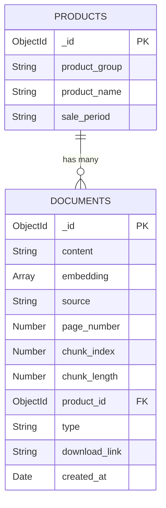

# MongoDB Document Schema Design
# KT AICC 기반 RAG 상담 지원 서비스

> **KT의 AICC(AI Contact Center)를 본떠 만든 RAG(Retrieval-Augmented Generation) 기반 AI 상담 지원 서비스의 데이터베이스 스키마입니다. 한화손해보험을 가상 고객사로 가정하여 구현한 사례로, 보험 상품 관련 상담을 지원하는 시스템의 데이터 구조를 정의합니다.**

## 1. 컬렉션 구조

### 1.1 products 컬렉션 (상품 정보)

| 필드명 | 타입 | 설명 | 예시 |
|--------|------|------|------|
| _id | ObjectId | 고유 식별자 | ObjectId |
| product_group | String | 상품군 | "자동차보험-개인용" |
| product_name | String | 상품명 | "한화다이렉트개인용자동차보험" |
| sale_period | String | 판매기간 | "2025.08.16~현재" |

### 1.2 documents 컬렉션 (문서 청크)

| 필드명 | 타입 | 설명 | 예시 |
|--------|------|------|------|
| _id | ObjectId | 고유 식별자 | ObjectId |
| content | String | 텍스트 청크 내용 | "이 약관은 보험소비자의 권익보호..." |
| embedding | Array | Azure OpenAI 임베딩 벡터 (1536차원) | [0.123, -0.456, ...] |
| source | String | PDF 파일명 | "한화다이렉트자동차보험_2025.08.16~현재_약관.pdf" |
| page_number | Number | PDF 페이지 번호 | 1, 2, 3... |
| chunk_index | Number | 페이지 내 청크 순서 | 0, 1, 2... |
| chunk_length | Number | 청크 길이 (문자 수) | 331, 581, 706... |
| product_id | ObjectId | 상품 참조 ID (products 컬렉션 참조) | ObjectId |
| type | String | 문서 타입 | "약관", "상품요약", "사업방법" |
| download_link | String | 원본 문서 링크 | "https://www.hwgeneralins.com/..." |
| created_at | Date | 생성 시간 | ISODate("2025-01-XX") |

## 2. 데이터 관계

### 2.1 관계 구조
```
products (1) ←→ (N) documents
```

### 2.2 관계 다이어그램



### 2.3 주요 쿼리 예시

```javascript
// 상품 정보와 함께 문서 조회
db.documents.aggregate([
  {
    $lookup: {
      from: "products",
      localField: "product_id",
      foreignField: "_id",
      as: "product_info"
    }
  }
])

// 특정 상품의 특정 문서 타입 검색
db.documents.find({
  "product_id": ObjectId("상품ID"),
  "type": "약관"
})
```

## 3. 핵심 특징

- **벡터 검색**: Azure OpenAI 임베딩을 통한 의미적 유사도 검색
- **문서 참조**: 답변과 함께 원본 문서 링크 제공
- **정규화**: 상품 정보 중복 저장 방지
- **확장성**: 새로운 상품 및 문서 타입 추가 용이

---

*이 문서는 KT AICC 기반 RAG 상담 지원 서비스의 MongoDB 스키마 설계를 다룹니다.*
