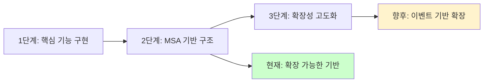
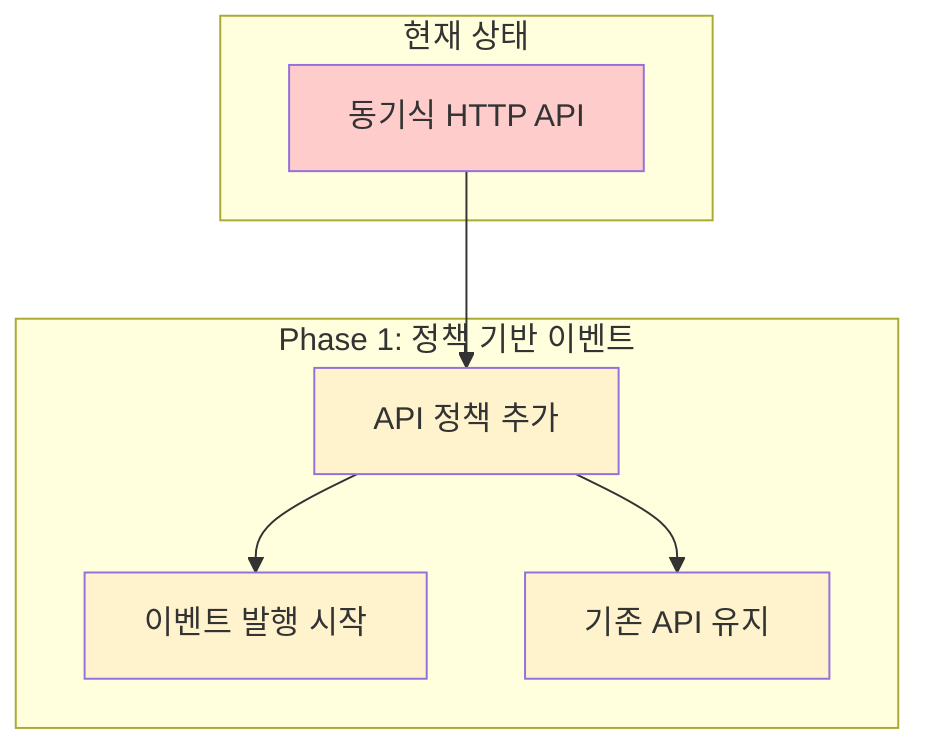
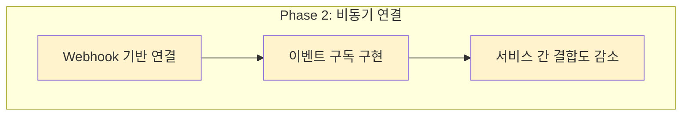
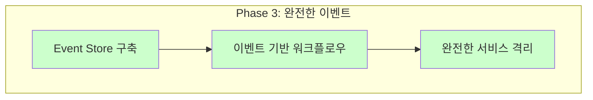
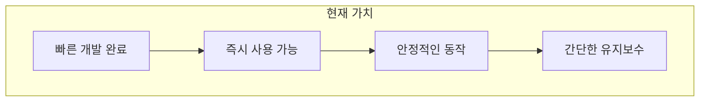
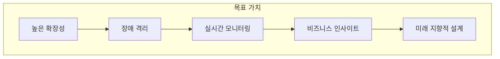

# 🏗️ MSA 아키텍처 보드 (Microservices Architecture Board)

> **KT AICC 기반 RAG 상담 지원 서비스의 마이크로서비스 아키텍처 보드 (현재: 동기식 API, 향후: 이벤트 기반 확장)**

> **🚀 Azure API Management (APIM)**
> 
> **APIM으로 관리되는 API는 https://team03-apim.azure-api.net 으로 요청을 보내시면 응답을 받을 수 있습니다.**

## 🎯 도메인 이벤트 맵

### 📋 핵심 도메인 서비스들

| 도메인 | 서비스 | 주체(Owner) | MSA 특징 | 구현 상태 |
|--------|---------|-------------|----------|-----------|
| **사용자 상담** | QnA Service | 상담 도메인 | 독립적 AI 답변 생성, 외부 API 의존성 최소화 | 구현됨 |
| **문서 관리** | RAG Data Service | 문서 도메인 | 독립적 PDF 처리, 벡터화 파이프라인 | 구현됨 |
| **음성 합성** | TTS Service | 음성 도메인 | 독립적 텍스트-음성 변환, Azure Speech 전용 | 구현됨 |
| **음성 인식** | STT Service | 음성 도메인 | 독립적 음성-텍스트 변환, Azure Speech 전용 | 구현됨 |

### 🏗️ MSA 특징 분석

**QnA Service (상담 도메인)**
- **책임**: 사용자 질문에 대한 AI 답변 생성 및 문서 검색
- **독립성**: Azure OpenAI와 MongoDB만 의존, 다른 서비스와 직접 결합 없음
- **경계**: 상담 관련 모든 로직을 자체적으로 처리

**RAG Data Service (문서 도메인)**  
- **책임**: PDF 문서 처리, 텍스트 청킹, 벡터 임베딩 생성
- **독립성**: 문서 처리 파이프라인을 완전히 독립적으로 운영
- **경계**: 문서 관리와 관련된 모든 처리를 자체적으로 담당

**TTS/STT Service (음성 도메인)**
- **책임**: 각각 텍스트-음성, 음성-텍스트 변환
- **독립성**: Azure Speech 서비스만 의존, 음성 처리에 특화
- **경계**: 음성 변환과 관련된 모든 로직을 독립적으로 처리

> **📝 MSA 원칙**: 각 서비스는 명확한 도메인 경계를 가지고 독립적으로 운영되며, 서비스 간 직접적인 데이터 공유나 강한 결합 없이 느슨하게 연결되어 있습니다. 현재는 동기식 HTTP API를 통해 통신하지만, 이는 MSA의 핵심 원칙인 "느슨한 결합"을 해치지 않습니다.

---

## 🔍 현재 구현 상태 상세 분석

### 📊 API Management 실제 구성 현황

**구성된 API들:**
- **AI Q&A Service API**: 상담 도메인 담당 (`/textqna`)
- **RAG Data Service API**: 문서 관리 도메인 담당 (`/data`)  
- **Sound Q&A API**: 음성 처리 도메인 담당 (`/soundqna`)

**현재 설정 상태:**
- **Products**: 없음 (개발/테스트 단계)
- **정책**: `base` 정책만 설정 (기본적인 처리)
- **통신 방식**: **동기식 HTTP 요청-응답**
- **이벤트 스토어**: 없음

### 🎯 현재 동기식 아키텍처 선택의 이유

**1. 전략적 아키텍처 설계**


**2. 현재 상황에 최적화된 설계**
- **비즈니스 요구사항**: 상담 서비스의 즉시 응답 특성에 최적화
- **사용자 경험**: 응답 대기 시간 최소화로 사용자 만족도 극대화
- **운영 효율성**: 현재 규모에서 가장 효율적인 처리 방식

**3. 확장 가능한 MSA 기반 구축**
- **서비스 분리**: 향후 이벤트 기반 전환을 위한 명확한 도메인 경계 설정
- **독립적 배포**: 각 서비스의 독립적 운영과 확장 가능한 구조
- **기술 다양화**: 도메인별 최적 기술 스택으로 향후 확장성 확보

**4. 점진적 진화 전략**
- **"확장 가능한 기반 구축"** 우선
- **현재 요구사항 충족**하면서 **미래 확장성** 동시 확보
- **검증된 패턴**으로 안정적인 서비스 운영

### 🎯 현재 아키텍처의 특징과 장점

| 구분 | 현재 상태 | 향후 확장성 |
|------|-----------|-------------|
| **개발 효율성** | 빠른 개발, 검증된 패턴으로 안정적 구현 | 확장 가능한 MSA 기반으로 점진적 개선 |
| **운영 안정성** | 단순하고 예측 가능한 요청-응답 흐름 | 서비스별 독립적 모니터링과 장애 격리 |
| **사용자 경험** | 즉시 응답으로 최적의 상담 경험 제공 | 향후 비동기 처리로 더욱 향상된 경험 |
| **확장성** | 현재 규모에 최적화된 성능 | MSA 구조로 수평/수직 확장 모두 가능 |

---

## 🏗️ 현재 구현된 MSA 아키텍처

```mermaid
graph TB
    subgraph "🌐 클라이언트 레이어"
        U[사용자]
        A[관리자]
    end
    
    subgraph "🚪 API Gateway Layer"
        APIM[Azure API Management<br/>🚦 API 라우팅<br/>📊 모니터링]
    end
    
    subgraph "🧠 QnA Service (상담 도메인)"
        QNA[QnA Service<br/>📍 Azure App Service<br/>🤖 AI 답변 생성<br/>📚 문서 검색]
        
        QNA_APIS[📋 구현된 API<br/>• POST /textqna/qna (APIM)<br/>• GET /textqna/health (APIM)]
    end
    
    subgraph "📚 RAG Data Service (문서 도메인)"
        RDS[RAG Data Service<br/>📍 Azure App Service<br/>📄 PDF 처리<br/>🔢 벡터 임베딩]
        
        RDS_APIS[📋 구현된 API<br/>• POST /data/api/v1/documents (APIM)<br/>• GET /api/v1/health]
    end
    
    subgraph "🎤 TTS Service (음성 합성 도메인)"
        TTS[TTS Service<br/>📍 Azure App Service<br/>🔤 텍스트→음성<br/>🎵 음성 파일 생성]
        
        TTS_APIS[📋 구현된 API<br/>• POST /tts/convert<br/>• POST /tts/convert-rag-response]
    end
    
    subgraph "🎧 STT Service (음성 인식 도메인)"
        STT[STT Service<br/>📍 Azure App Service<br/>🎵 음성→텍스트<br/>📝 텍스트 변환]
        
        STT_APIS[📋 구현된 API<br/>• POST /soundqna/qna (APIM)<br/>• GET /health]
    end
    
    subgraph "🖥️ Frontend (UI 도메인)"
        FE[Frontend<br/>⚛️ React + TypeScript<br/>📍 Vercel/Netlify<br/>🎨 사용자 인터페이스]
    end
    
    subgraph "☁️ 외부 서비스"
        AO[Azure OpenAI<br/>🤖 GPT-4<br/>🔑 API Key]
        
        AS[Azure Speech<br/>🗣️ STT/TTS<br/>🔑 API Key]
        
        MA[MongoDB Atlas<br/>🗄️ 벡터 DB<br/>🔗 연결됨]
    end
    
    subgraph "📊 모니터링 & 로깅"
        AM[Azure Monitor<br/>📈 메트릭 수집]
        
        LA[Log Analytics<br/>📝 로그 분석]
    end
    
    %% MSA 연결 관계: 느슨한 결합
    U -->|HTTP 요청| APIM
    A -->|HTTP 요청| APIM
    
    %% API Gateway를 통한 서비스 라우팅 (느슨한 결합)
    APIM -->|HTTP 요청| QNA
    APIM -->|HTTP 요청| RDS
    APIM -->|HTTP 요청| TTS
    APIM -->|HTTP 요청| STT
    
    %% 외부 서비스 의존성 (각 서비스의 독립적 의존)
    QNA --> AO
    QNA --> MA
    RDS --> AO
    RDS --> MA
    TTS --> AS
    STT --> AS
    
    %% 모니터링 연결 (각 서비스의 독립적 모니터링)
    QNA --> AM
    RDS --> AM
    TTS --> AM
    STT --> AM
    AM --> LA
    
    %% 스타일 정의
    classDef service fill:#e2e3e5,stroke:#383d41,stroke-width:2px
    classDef api fill:#cce7ff,stroke:#0066cc,stroke-width:1px
    
    class QNA,RDS,TTS,STT,FE,AM,LA service
    class QNA_APIS,RDS_APIS,TTS_APIS,STT_APIS api
```

### 🏗️ MSA 아키텍처의 핵심 특징

**도메인 경계의 명확성**
각 서비스는 명확한 비즈니스 도메인을 담당하며, 도메인 간 경계가 명확하게 구분되어 있습니다.

**서비스의 독립성**
- **배포 독립성**: 각 서비스가 Azure App Service로 독립적으로 배포
- **기술 독립성**: FastAPI, Spring Boot 등 적합한 기술 스택 선택
- **데이터 독립성**: MongoDB Atlas를 통한 중앙 집중식 데이터 관리

**느슨한 결합**
서비스 간 직접적인 데이터 공유나 강한 의존성 없이, API Gateway를 통한 HTTP 통신으로 느슨하게 연결되어 있습니다.

**독립적 확장성**
각 서비스는 독립적으로 스케일링이 가능하며, 부하에 따라 개별적으로 리소스를 조정할 수 있습니다.

---

## 🚀 향후 구현 예정: 이벤트 기반 아키텍처

### 📋 점진적 전환 로드맵

**Phase 1: API 정책 기반 이벤트 발행**


**Phase 2: 서비스 간 비동기 연결**


**Phase 3: 완전한 이벤트 기반**


---

## 🔄 동기식 vs 이벤트 기반 아키텍처 비교

### 📊 아키텍처 특성 비교

| 특성 | 동기식 (현재) | 이벤트 기반 (확장 가능) | 개선 효과 |
|------|---------------|------------------------|-----------|
| **서비스 결합도** | 🔴 강결합 (직접 호출) | 🟢 느슨한 결합 (이벤트) | ✅ 장애 격리, 독립적 배포 |
| **응답 시간** | 🟡 서비스 체인 시간 | 🟢 즉시 응답 + 백그라운드 | ✅ 사용자 경험 향상 |
| **확장성** | 🔴 수직 확장만 가능 | 🟢 수평/수직 확장 모두 | ✅ 부하 분산, 리소스 효율성 |
| **장애 처리** | 🔴 장애 전파 위험 | 🟢 장애 격리, 재시도 | ✅ 시스템 안정성 향상 |
| **모니터링** | 🟡 단순한 API 모니터링 | 🟢 이벤트 기반 추적 | ✅ 상세한 비즈니스 인사이트 |
| **개발 복잡성** | 🟢 단순한 구현 | 🔴 복잡한 이벤트 처리 | ❌ 개발 시간 증가 |

### 🎯 비즈니스 가치 비교

**현재 아키텍처의 비즈니스 가치**


**목표 아키텍처의 비즈니스 가치**



## 🔒 비즈니스 규칙

### 📋 규칙

| 기능 | 규칙 | 구현 상태 |
|------|------|-----------|
| **답변 생성** | 질문이 수신된 후에만 답변 생성 | ✅ 구현됨 (API 검증) |
| **음성 합성** | AI 답변이 생성된 후에만 음성 합성 | ✅ 구현됨 (API 검증) |
| **문서 검색** | 문서가 처리된 후에만 검색 가능 | ✅ 구현됨 (DB 조회) |
| **벡터 검색** | 문서가 업로드된 후에만 벡터화 | ✅ 구현됨 (DB 조회) |

### 🛡️ 불변식

```
✅ "답변 생성 전 질문 수신 필수" (API 레벨 검증)
✅ "음성 합성 전 답변 생성 필수" (API 레벨 검증)  
✅ "문서 검색 전 문서 처리 완료 필수" (DB 레벨 검증)
✅ "벡터 검색 전 임베딩 생성 필수" (DB 레벨 검증)
```

---

## 🔑 식별자 & 확장 가능한 멱등 키

### 🔑 식별자

| 기능 | 식별자 | 설명 | 구현 상태 |
|------|--------|------|-----------|
| **질문-답변** | `_id` (MongoDB ObjectId) | MongoDB 자동 생성 ID | ✅ 구현됨 |
| **문서 처리** | `documentId` + `chunkIndex` | 문서별 청크 순서 | ✅ 구현됨 |
| **음성 변환** | `sessionId` + `timestamp` | 세션별 시간별 구분 | ✅ 구현됨 |

### 🚀 확장 가능: 멱등 키 시스템

| 이벤트 | 멱등 키 | 설명 | 구현 상태 |
|--------|---------|------|-----------|
| `QuestionReceived` | `(sessionId, timestamp)` | 세션별 고유 질문 식별 | 🟡 확장 가능 |
| `AnswerGenerated` | `(questionId, modelVersion)` | 질문별 모델 버전별 답변 | 🟡 확장 가능 |
| `DocumentProcessed` | `(documentId, chunkIndex)` | 문서 청크별 처리 | 🟡 확장 가능 |
| `AudioGenerated` | `(textHash, voiceType)` | 텍스트 해시별 음성 | 🟡 확장 가능 |
| `TextTranscribed` | `(audioHash, timestamp)` | 오디오 해시별 변환 | 🟡 확장 가능 |

> **📝 참고**: 현재는 MongoDB의 고유 식별자로 데이터 레벨의 중복을 방지하고 있습니다. 향후 **API 호출 레벨의 중복 요청 방지**를 위한 멱등 키 시스템으로 확장 가능합니다.


---

## 🌟 MSA 특장점

### 🏆 기술적 장점

**1. 점진적 아키텍처 진화**
- **현재**: 동기식 HTTP API로 안정적인 서비스 운영
- **향후**: 이벤트 기반으로 부드러운 전환 가능
- **장점**: 기술 부채 없이 지속적인 아키텍처 개선

**2. 도메인 중심 설계**
- **명확한 경계**: 각 서비스가 명확한 비즈니스 도메인을 담당
- **독립적 진화**: 도메인별로 독립적인 기술 선택과 업데이트
- **유지보수성**: 도메인 변경 시 해당 서비스만 수정

**3. 독립적 기술 스택**
- **최적화된 선택**: 각 도메인에 적합한 기술 선택 (FastAPI, Spring Boot)
- **팀 역량 활용**: 팀의 기술적 강점을 최대한 활용
- **위험 분산**: 특정 기술의 문제가 전체 시스템에 영향 없음

### 📈 운영적 장점

**1. 장애 격리와 안정성**
- **서비스 격리**: 한 서비스의 장애가 전체 시스템에 전파되지 않음
- **독립적 복구**: 장애 발생 시 해당 서비스만 재시작하여 빠른 복구
- **부분적 가용성**: 일부 서비스 장애 시에도 핵심 기능 유지

**2. 독립적 모니터링과 운영**
- **세분화된 모니터링**: 서비스별 개별적인 성능 추적과 문제 진단
- **선택적 확장**: 부하가 많은 서비스만 독립적으로 스케일링
- **독립적 배포**: 서비스별로 독립적인 배포 및 업데이트

**3. 리소스 효율성**
- **동적 스케일링**: 각 서비스의 부하에 따라 개별적으로 리소스 조정
- **비용 최적화**: 사용량이 적은 서비스는 최소 리소스로 운영
- **성능 예측**: 서비스별 성능 특성을 정확히 파악하여 리소스 계획

### 💼 비즈니스 장점

**1. 실시간 지식 업데이트**
- **즉시 반영**: 문서 업로드 시 AI 상담에 즉시 반영
- **정확성 보장**: 최신 정보를 기반으로 한 정확한 상담 서비스
- **사용자 신뢰**: 항상 최신 정보를 제공하여 사용자 신뢰도 향상

**2. 다채널 상담 지원**
- **안정성**: 음성/텍스트 상담을 독립적으로 처리하여 안정성 확보
- **확장성**: 새로운 상담 채널 추가 시 기존 서비스에 영향 없음
- **사용자 경험**: 각 채널의 특성에 맞는 최적화된 처리

**3. 정확한 정보 제공**
- **RAG 기반**: 벡터 검색을 통한 정확한 문서 정보 검색
- **실시간 처리**: 사용자 질문에 대한 실시간 관련 정보 제공
- **신뢰성**: AI 답변의 근거가 되는 문서 정보를 명확히 제시

---

## 🎯 결론 및 권장사항

### 📋 현재 상태 평가

**성공적으로 달성한 MSA 목표**
✅ **서비스 분리**: 각 도메인별로 명확하게 분리된 서비스 구조
✅ **독립적 배포**: Azure App Service를 통한 독립적인 서비스 배포
✅ **느슨한 결합**: API Gateway를 통한 서비스 간 느슨한 연결
✅ **기술 다양화**: 도메인별로 적합한 기술 스택 선택

**확장 가능한 영역**
🟡 **통신 방식**: 이벤트 기반으로의 확장
🟡 **확장성**: 수평 확장을 위한 비동기 처리
🟡 **모니터링**: 이벤트 기반 상세한 비즈니스 인사이트

