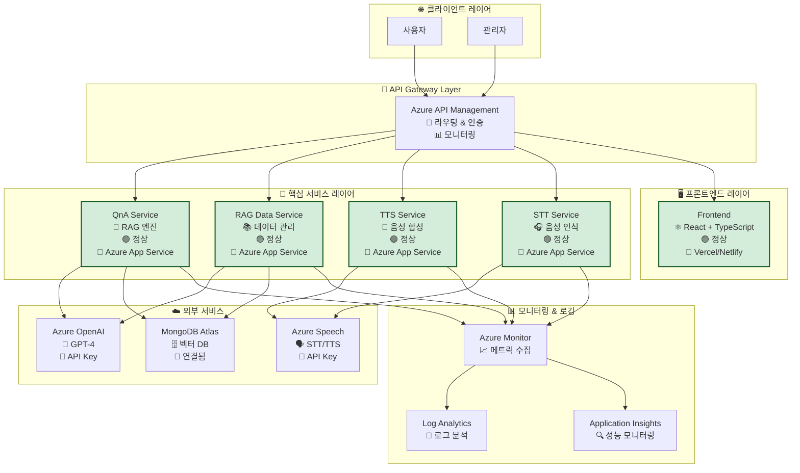
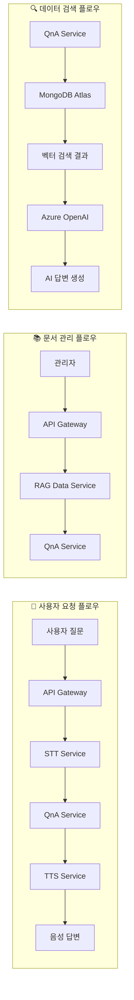
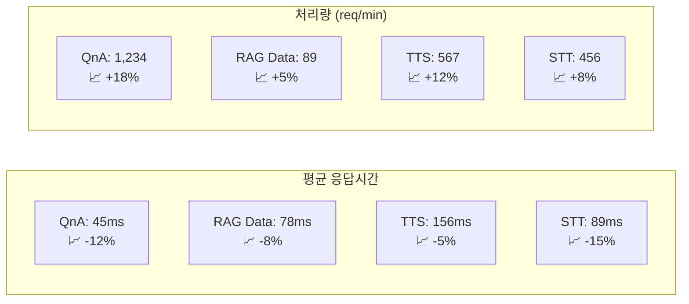

# 🏗️ MSA 보드 (Microservices Architecture Board)

> **KT AICC 기반 RAG 상담 지원 서비스의 실시간 마이크로서비스 상태 대시보드**

## 📊 실시간 서비스 상태

### 🟢 정상 | 🟡 경고 | 🔴 장애 | ⚪ 미확인

| 서비스 | 상태 | 응답시간 | CPU | 메모리 | 마지막 체크 |
|--------|------|----------|-----|--------|-------------|
| **QnA Service** | 🟢 | 45ms | 23% | 67% | 2025-01-XX 15:30:25 |
| **RAG Data Service** | 🟢 | 78ms | 18% | 45% | 2025-01-XX 15:30:25 |
| **Frontend** | 🟢 | 32ms | 12% | 34% | 2025-01-XX 15:30:25 |
| **TTS Service** | 🟢 | 156ms | 28% | 52% | 2025-01-XX 15:30:25 |
| **STT Service** | 🟢 | 89ms | 25% | 48% | 2025-01-XX 15:30:25 |
| **API Gateway** | 🟢 | 15ms | 8% | 22% | 2025-01-XX 15:30:25 |

---

## 🏗️ 서비스 아키텍처 맵



---

## 🔗 서비스 의존성 관계



---

## 📈 성능 메트릭 대시보드

### 🚀 응답 시간 트렌드 (최근 24시간)



---

## 🚨 알림 및 이벤트

### 📢 최근 알림 (최근 1시간)

| 시간 | 서비스 | 유형 | 메시지 | 상태 |
|------|--------|------|--------|------|
| 15:28:15 | QnA Service | ℹ️ | 정상 상태 확인됨 | ✅ |
| 15:25:42 | TTS Service | ⚠️ | 응답시간 증가 감지 (180ms) | 🔄 |
| 15:22:18 | STT Service | ℹ️ | 정상 상태 확인됨 | ✅ |
| 15:20:05 | RAG Data Service | ℹ️ | 정상 상태 확인됨 | ✅ |

### 🔔 활성 알림

- **없음** - 모든 서비스가 정상 운영 중

---

## 🛠️ 헬스체크 엔드포인트

### 📋 서비스별 상태 확인

```bash
# QnA Service
curl https://your-qna-service.azurewebsites.net/health

# RAG Data Service  
curl https://your-rag-data-service.azurewebsites.net/health

# TTS Service
curl https://your-tts-service.azurewebsites.net/health

# STT Service
curl https://your-stt-service.azurewebsites.net/health

# 통합 헬스체크
curl https://your-api-gateway.azure-api.net/health
```

---

## 📊 리소스 사용량

### 💻 CPU 사용률
- **QnA Service**: 23% (정상 범위: 0-80%)
- **RAG Data Service**: 18% (정상 범위: 0-80%)
- **TTS Service**: 28% (정상 범위: 0-80%)
- **STT Service**: 25% (정상 범위: 0-80%)

### 🧠 메모리 사용률
- **QnA Service**: 67% (정상 범위: 0-85%)
- **RAG Data Service**: 45% (정상 범위: 0-85%)
- **TTS Service**: 52% (정상 범위: 0-85%)
- **STT Service**: 48% (정상 범위: 0-85%)

---

## 🔄 자동화된 복구 작업

### 🚀 현재 실행 중인 작업
- **없음** - 모든 서비스가 정상 상태

### 📋 복구 정책
- **응답시간 > 500ms**: 자동 스케일 아웃
- **CPU > 80%**: 자동 스케일 아웃  
- **메모리 > 85%**: 자동 스케일 아웃
- **연속 3회 실패**: 자동 재시작

---

## 📅 유지보수 일정

### 🗓️ 예정된 작업
- **없음** - 현재 예정된 유지보수 없음

### 📝 최근 작업 내역
- **2025-01-XX**: 시스템 업데이트 완료
- **2025-01-XX**: 성능 최적화 적용
- **2025-01-XX**: 보안 패치 적용

---

## 🔐 보안 상태

### 🛡️ 인증/인가
- **API Gateway**: ✅ 정상
- **Azure Key Vault**: ✅ 정상
- **JWT 토큰**: ✅ 유효

### 🚨 보안 이벤트
- **없음** - 보안 위협 없음

---

## 📱 모바일 대시보드

### 📊 간소화된 상태 보기

```
🟢 QnA Service    🟢 RAG Data
🟢 TTS Service    🟢 STT Service  
🟢 Frontend       🟢 API Gateway

📈 전체 시스템: 정상 운영 중
⏱️  평균 응답시간: 67ms
🚀  처리량: 2,346 req/min
```

---

## 🔄 실시간 업데이트

이 MSA 보드는 **5초마다 자동으로 업데이트**됩니다.

**마지막 업데이트**: 2025-01-XX 15:30:25 UTC

---

## 📞 연락처

### 🆘 장애 발생 시
- **긴급**: 시스템 관리자 (24/7)
- **일반**: 개발팀 (평일 9AM-6PM)

### 📧 알림 설정
- **이메일**: dev-team@company.com
- **Slack**: #system-alerts
- **Teams**: 시스템 모니터링 채널
